# 🔍 Job Portal
  
> A comprehensive, cross-platform recruitment system designed for **employers, job seekers, and administrators**.  
> The platform integrates an **intelligent recommendation engine** that:
> - Helps job seekers quickly discover opportunities that match their skills and preferences.
> - Assists employers in finding the most suitable candidates for their job postings.  
>  
> With a user-friendly interface, scalable architecture, and full-feature support, this system aims to **enhance the recruitment and job-seeking experience** while **optimizing the connection between candidates and recruiters**.

---

## 📸 Demo

<!-- Thay thế bằng hình ảnh hoặc video -->
> Some images of the job seeker app:

  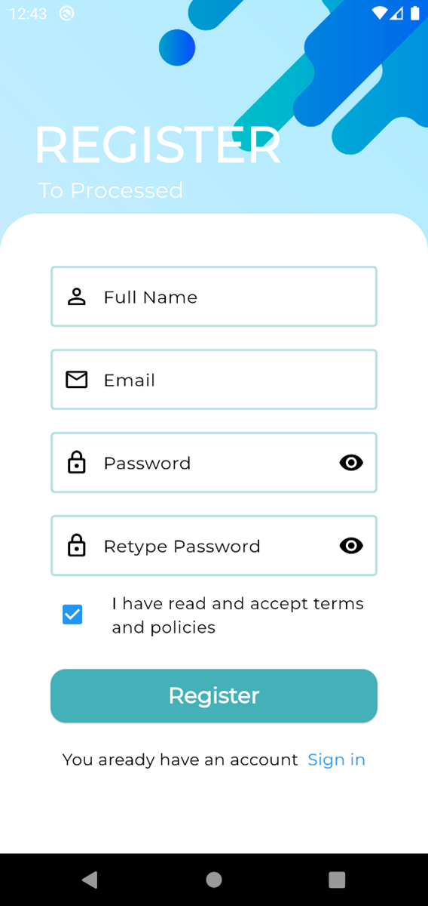
  
  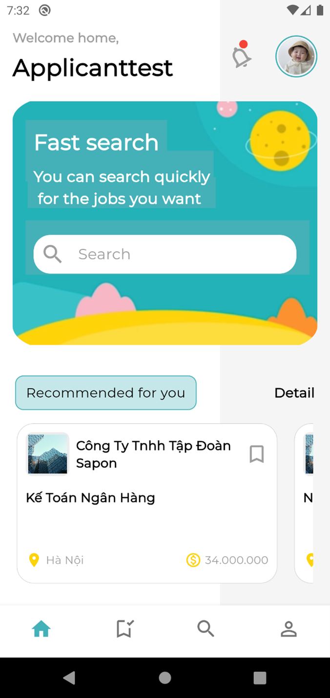
   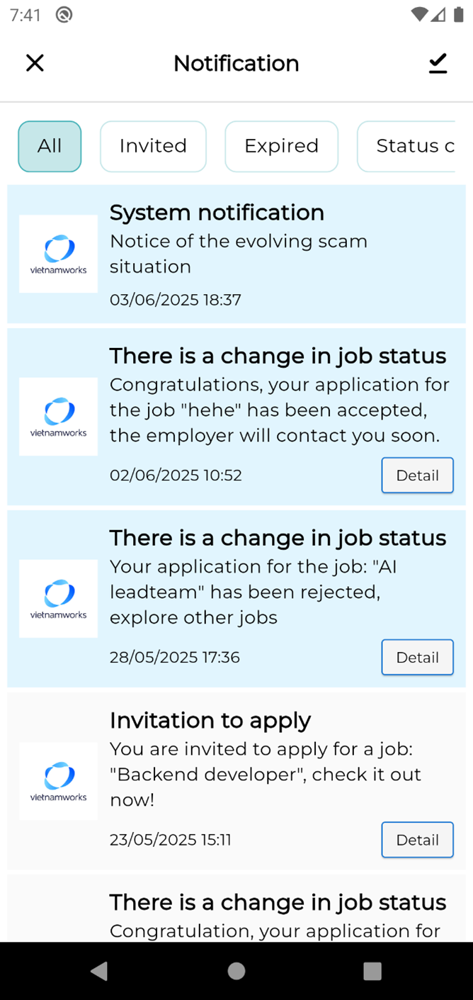
   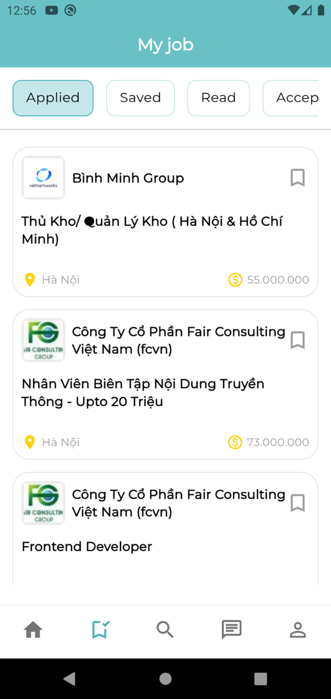
   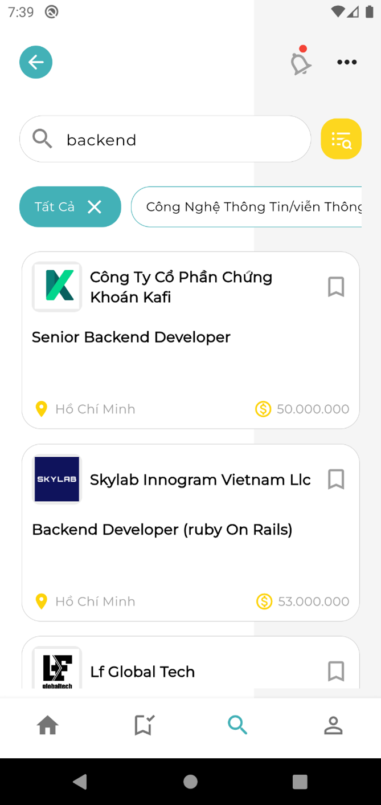
   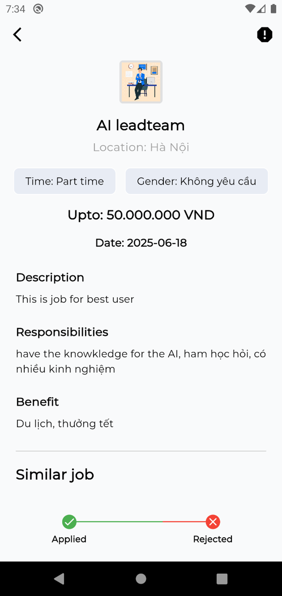
   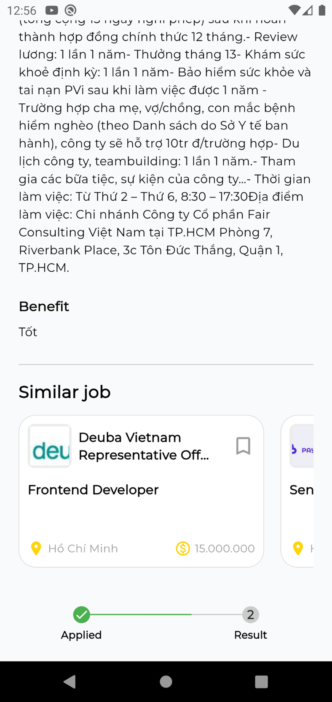

> Some images of the recruitment website:

  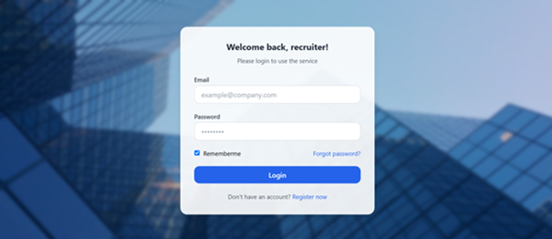
  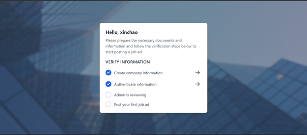
  
   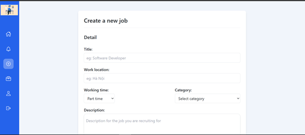
   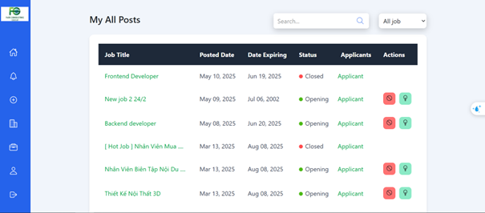
   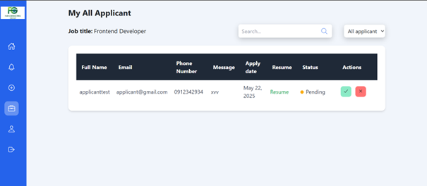
   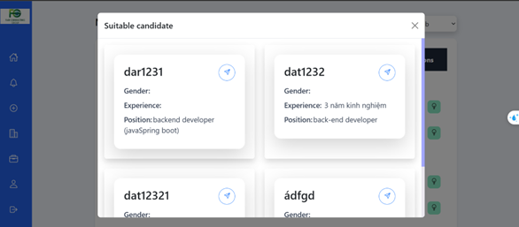
   

> Some images of the management website:

  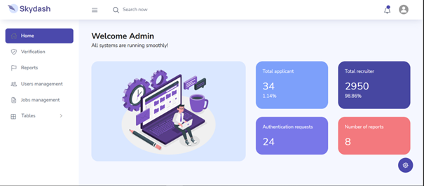
  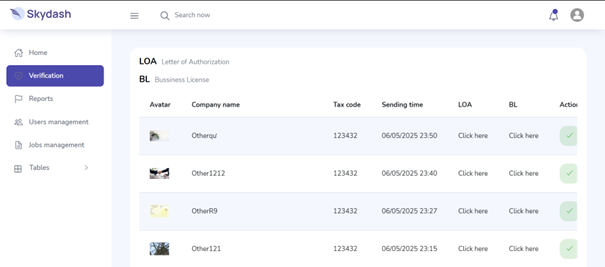
  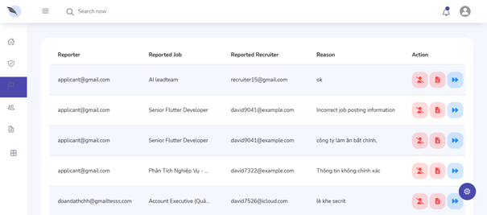
   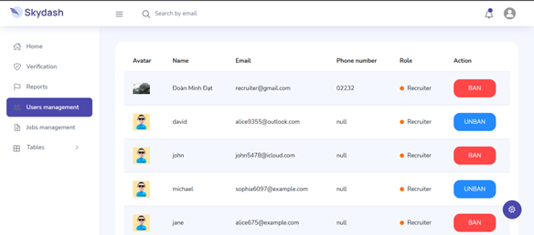
   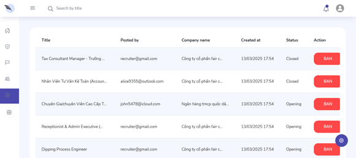

   

---

## ✨ Main function

- User authentication and authorization with spring security and jwt, password hashing before storing in database.
- Automatically schedule events with Scheduled annotation.
- Suggest suitable jobs to candidates based on the data they provide and their behavior
- Scrape large amounts of data to enrich the system.
- Verify employer and company information before they can post.
- Suggest to employers candidates with the most suitable skills and work experience.
- Admin management system makes system coordination easy

---

## 🛠️ Technology used

| Frontend      | Backend       | Other                  |
|---------------|---------------|------------------------|
| HTML, CSS, JS / Flutter | Spring Secirity / Spring Boot |  MySQL  |
| TailwindCSS / Bootstrap | FastAPI | JWT etc. |

---

## ⚙️ Installation

### Required:
- Python version > 3.12.6 / JDK version > 17 / Flutter version > 3.27

